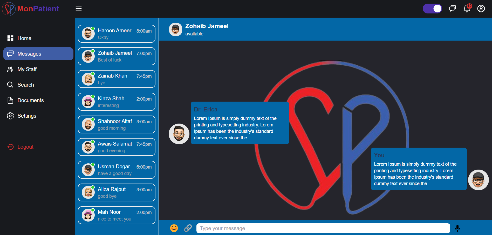

# Getting Started

This repository contains the source code for a modern, responsive patient website built with React, TailwindCSS, JavaScript, Sass, and CSS. The website is designed to provide an intuitive and seamless experience for patients to manage their appointments, view medical records, and communicate with healthcare providers.

```bash
# using npm
npm run dev
```

## Screenshots
## Laptop
<div style="display: flex; flex-direction: 'row';">


</div>

## Laptop Dark mode
<div style="display: flex; flex-direction: 'row';">




</div>

## Laptop Signin & Signup
<div style="display: flex; flex-direction: 'row';">


</div>

## Responsive
<div style="display: flex; flex-direction: 'row';">


</div>

## Responsive Dark Mode
<div style="display: flex; flex-direction: 'row';">


</div>

## Responsive Signin & Signup
<div style="display: flex; flex-direction: 'row';">


</div>

## Vedio
<div style="display: flex; flex-direction: 'row';">

</div>

Source code files are available

## Congratulations! :tada:

You've successfully run and modified your Patient WebSite